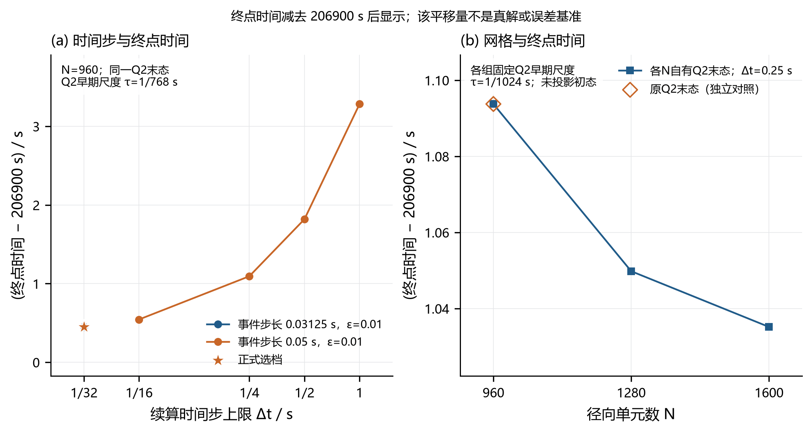

# 问题3精度验证报告

本报告只读取已保存的验证JSON和算例元数据，没有重新运行数值模拟。缺失记录表示尚无证据，不计为通过；保留粗档失败记录，也不把粗档失败等同于之后细档一定失败。

## 当前选档状态

已读取 `validation/q3_selected_config.json`；各项比较结论仍以本报告下表中的实际差值为准。

| 选档字段 | 记录值 |
|---|---|
| status | validated |
| validated | True |
| selected_run_label | q3_N960_dt0.03125_production_evdt0.05_tol0.01 |
| selected_run_path | q3/runs/q3_N960_dt0.03125_production_evdt0.05_tol0.01.npz |
| cells | 960 |
| dt_max | 0.03125 |
| event_dt | 0.03125 |
| event_tol | 0.01 |
| finish_time_s | 206900.44921875 |
| finish_time_h | 57.472347005208334 |

该选档对应本报告算例 R10；星号表示该记录（不表示真解）。

## 正式选档的必需比较

该部分读取独立验收程序重新从原始数组计算的差值，不用历史粗档的全矩阵标志代替选档判断。

记录结论：所列必需比较全部通过；正式数组与选定算例逐项一致；数值源和输入哈希核对记录共 14 项。

| 检查 | 比较 | maxΔC/(kg/kg) | 最大差位置(t/s,r/cm) | Δ终点/s | 限值C/终点s | 记录结论 |
|---|---|---:|---|---:|---|---|
| 时间步 | R08→R10 | 5.48303050e-07 | (26640, 0) | 0.0952148438 | 2e-05 / 0.1 | 通过 |
| 空间网格 | R01→R02 | 2.16386384e-06 | (60, 2) | 0.0439453125 | 2e-05 / 0.1 | 通过 |
| 空间网格 | R02→R03 | 1.00156850e-06 | (60, 2) | 0.0146484375 | 2e-05 / 0.1 | 通过 |
| 空间网格跨两档 | R01→R03 | 3.16543234e-06 | (60, 2) | 0.05859375 | 2e-05 / 0.1 | 通过 |
| Q2末态来源 | R07→R01 | 1.76672462e-07 | (60, 2) | 0 | 2e-05 / 0.1 | 通过 |
| 事件夹逼容差 | R09→R11 | 0.00000000e+00 | (0, 0) | 0 | 2e-05 / 0.02 | 通过 |
| 事件积分步长 | R11→R12 | 0.00000000e+00 | (0, 0) | 0 | 2e-05 / 0.02 | 通过 |
| Picard容差 | R04→R05 | 5.57561636e-12 | (123660, 2) | 0 | 2e-05 / 0.1 | 通过 |

这里的通过限定于规定输出位置、比较档次和预定门槛，不转换为对未知精确解的误差上界。

## 比较量与验收范围

令 $/mathcal S_{ab}$ 为两组计算共同存在的整60秒、21个径向输出位置；不作时间或空间插值。定义

/[
E_C^{(a,b)}=/max_{(t,r)/in/mathcal S_{ab}}|C_a(t,r)-C_b(t,r)|,/qquad
E_t^{(a,b)}=|t_{+,a}-t_{+,b}|.
/]

正式数值比较门槛为 $E_C/le 2/times10^{-5}/ /mathrm{kg/kg}$、$E_t/le0.1/ /mathrm{s}$；事件夹逼容差复核另按记录中更严的终点差门槛（若为0.02 s则照实列出）判断。温度差记录只作补充，不与含水率门槛混用。

事件定位同时检查 $g(t_-)=M(t_-)-0.15/ge0$、$g(t_+)<0$ 与 $t_+-t_-/le/varepsilon_t$。事件括区宽度衡量固定数值轨道上的定位分辨率，不能代替时间积分误差、空间离散误差或早期初态误差。

比较包括0秒和两者共同存在的完整整分输出；终点场各自属于不同的终点时刻，不能把两份终点场之差冒充同一时刻的离散误差。更细算例仍然是数值参考，以上差值不构成未知精确解的严格误差上界，也不是内部实测验证。

## 图8：独立改变步长与网格

时间步系列固定同一正式Q2末态；空间系列则让各个N使用各自原网格上的Q2末态，并匹配Q2早期时间尺度。原正式N=960的Q2末态来源单独画为空心菱形，不连接到空间系列中，也不把不同初态来源的变化全归于网格。图中纵轴仅减去一个共同常数以便读数，该常数没有真解含义。

## 已保存算例与初态来源

| 编号 | N | 续算Δt/s | 事件步长/s | 夹逼容差/s | Q2末态来源/早期τ/s | 终点/s | 夹逼宽度/s |
|---|---:|---:|---:|---:|---|---:|---:|
| R01 | 960 | 0.25 | 0.05 | 0.01 | 各网格原生/1/1024 | 206901.093750000 | 0.0073242188 |
| R02 | 1280 | 0.25 | 0.05 | 0.01 | 各网格原生/1/1024 | 206901.049804688 | 0.0073242188 |
| R03 | 1600 | 0.25 | 0.05 | 0.01 | 各网格原生/1/1024 | 206901.035156250 | 0.0073242188 |
| R04 | 960 | 1 | 0.05 | 0.01 | 原正式Q2/1/768 | 206903.283691406 | 0.0073242188 |
| R05 | 960 | 1 | 0.05 | 0.01 | 原正式Q2/1/768，Picard容差×0.01 | 206903.283691406 | 0.0073242188 |
| R06 | 960 | 0.5 | 0.05 | 0.01 | 原正式Q2/1/768 | 206901.818847656 | 0.0073242188 |
| R07 | 960 | 0.25 | 0.05 | 0.01 | 原正式Q2/1/768 | 206901.093750000 | 0.0073242188 |
| R08 | 960 | 0.0625 | 0.05 | 0.01 | 原正式Q2/1/768 | 206900.544433594 | 0.0073242188 |
| R09 | 960 | 0.03125 | 0.03125 | 0.01 | 原正式Q2，局部事件重积分/1/768 | 206900.449218750 | 0.0073242188 |
| R10 | 960 | 0.03125 | 0.03125 | 0.01 | 原正式Q2/1/768 | 206900.449218750 | 0.0073242188 |
| R11 | 960 | 0.03125 | 0.03125 | 0.001 | 原正式Q2，局部事件重积分/1/768 | 206900.449218750 | 0.00091552734 |
| R12 | 960 | 0.03125 | 0.015625 | 0.001 | 原正式Q2，局部事件重积分/1/768 | 206900.449218750 | 0.00091552734 |

同一编号只引用其存储的实际终点；没有对终点时间作Richardson外推。表中事件步长采用结果元数据中的实际值：当续算步长小于请求的事件步长时，求解器会相应缩小事件步长，不能把请求值当作实际值标注。

## 实际加密差值

| 检查 | 比较 | maxΔC/(kg/kg) | 最大差位置(t/s,r/cm) | Δ终点/s | 限值C/终点s | 记录结论 |
|---|---|---:|---|---:|---|---|
| 时间步 | R04→R06 | 8.77252834e-06 | (26640, 0) | 1.46484375 | 2e-05 / 0.1 | 未通过 |
| 时间步 | R06→R07 | 4.38635034e-06 | (26640, 0) | 0.725097656 | 2e-05 / 0.1 | 未通过 |
| 时间步 | R07→R08 | 3.28980048e-06 | (26640, 0) | 0.549316406 | 2e-05 / 0.1 | 未通过 |
| 时间步 | R08→R10 | 5.48303050e-07 | (26640, 0) | 0.0952148438 | 2e-05 / 0.1 | 通过 |
| 空间网格 | R01→R02 | 2.16386384e-06 | (60, 2) | 0.0439453125 | 2e-05 / 0.1 | 通过 |
| 空间网格 | R02→R03 | 1.00156850e-06 | (60, 2) | 0.0146484375 | 2e-05 / 0.1 | 通过 |
| 空间网格跨两档 | R01→R03 | 3.16543234e-06 | (60, 2) | 0.05859375 | 2e-05 / 0.1 | 通过 |
| Q2末态来源 | R07→R01 | 1.76672462e-07 | (60, 2) | 0 | 2e-05 / 0.1 | 通过 |
| 事件夹逼容差 | R09→R11 | 0.00000000e+00 | (0, 0) | 0 | 2e-05 / 0.02 | 通过 |
| 事件积分步长 | R11→R12 | 0.00000000e+00 | (0, 0) | 0 | 2e-05 / 0.02 | 通过 |
| Picard容差 | R04→R05 | 5.57561636e-12 | (123660, 2) | 0 | 2e-05 / 0.1 | 通过 |

表中“通过”只对应这一对算例和这一行的门槛；最终选档须综合时间、空间、Q2末态来源、事件积分与Picard检查。各报告顶层的全矩阵结果可能因保留粗档失败而为false，不能据此覆盖细档的逐项结论。

局部事件复核从同一完整锚点重新积分，并复用相同的此前轨迹；其共同整分输出差为0可能正是共享前缀的结果，不能用来证明全程时间离散已收敛。应分别阅读局部事件差值和整条轨迹的时间步比较。

## 水量与末态复核

使用初始干物质质量口径，独立重组保存字段 $B(t)=/overline C(t)+L_{/mathrm{cum}}(t)-2.55$；水量残差门槛为 $10^{-8}/ /mathrm{kg/kg}$。

| 算例 | 最大水量残差/(kg/kg) | 末态独立最大值/(kg/kg) | 严格低于0.15 | 全场/事件复核 |
|---|---:|---:|---|---|
| R01 | 3.15081294e-12 | 0.14999999815363663 | 是 | 通过 |
| R02 | 2.45092835e-12 | 0.14999999999420122 | 是 | 通过 |
| R03 | 2.04014583e-12 | 0.14999999961500748 | 是 | 通过 |
| R04 | 1.96287431e-12 | 0.14999999872318942 | 是 | 通过 |
| R05 | 8.93951579e-13 | 0.14999999872317948 | 是 | 通过 |
| R06 | 2.77333712e-12 | 0.14999999982244525 | 是 | 通过 |
| R07 | 2.73914225e-12 | 0.14999999823647769 | 是 | 通过 |
| R08 | 2.96340730e-12 | 0.14999999864623073 | 是 | 通过 |
| R09 | 2.53974619e-12 | 0.14999999978080958 | 是 | 通过 |
| R10 | 2.53974619e-12 | 0.14999999978080958 | 是 | 通过 |
| R11 | 2.53974619e-12 | 0.14999999978080958 | 是 | 通过 |
| R12 | 2.53930210e-12 | 0.14999999978037959 | 是 | 通过 |

已读取核心续算检查：原状态与磁盘重启、相同步序的旧新内核、绝对时间驱动及内部最大值检测检查通过。其含义是实现一致性，不是独立物理正确性证明。

正式结果文件检查记录：逐格核对 72408 个Excel浓度值、10 行表5，检查通过；此项证明导出与原数组一致。

## 附录程序的独立运行复现

该项核对同一离散方法和算法在自包含附录程序中的独立运行结果，来源链为原始附件与初始状态 → 独立重算Q2前3小时 → 使用该原网格末态续算Q3 → 导出独立结果表。它检验代码与结果可复现性，不属于独立物理模型或内部实测场验证。

前段来源记录：从原附件和初值重新求解已确认；独立求解未使用主程序缓存已确认；该阶段进程正常完成。记录的前段终止时间为 10800 s，径向单元数为 960。

| Q2前段核对量 | 数组形状 | 最大绝对差 | 逐项完全相等 |
|---|---|---:|---|
| 原网格 温度 / K | 960 | 0.00000000e+00 | 是 |
| 原网格 含水率 / (kg/kg) | 960 | 0.00000000e+00 | 是 |
| 原网格 单元面半径 / m | 961 | 0.00000000e+00 | 是 |
| 原网格 单元中心半径 / m | 960 | 0.00000000e+00 | 是 |
| 原网格 径向体积权重 / m² | 960 | 0.00000000e+00 | 是 |
| 逐秒21点 温度 / K | 10801 × 21 | 5.68434189e-14 | 否 |
| 逐秒21点 含水率 / (kg/kg) | 10801 × 21 | 4.44089210e-16 | 否 |

前段时间数组相等记录为 True，诊断日志相等记录为 True。此前段证据与下述全程Q3及Excel复核共同构成独立运行来源链。

全程复现核对文件的结论为：通过。配置为 N=960，续算步长上限 0.03125 s，事件步长 0.03125 s，夹逼容差 0.01 s。

共同整60秒、21个径向位置的每个场核对 72429 个值，时间范围为 [0.0, 206880.0] s；精确终点另列入完整输出核对。

| Q3核对量 | 数组形状 | 最大绝对差 | 逐项完全相等 |
|---|---|---:|---|
| 整分21点 温度 / K | 3449 × 21 | 5.68434189e-14 | 否 |
| 整分21点 含水率 / (kg/kg) | 3449 × 21 | 4.44089210e-16 | 否 |
| 含精确终点 温度 / K | 3450 × 21 | 5.68434189e-14 | 否 |
| 含精确终点 含水率 / (kg/kg) | 3450 × 21 | 4.44089210e-16 | 否 |
| 原网格末态/几何 温度 / K | 960 | 0.00000000e+00 | 是 |
| 原网格末态/几何 含水率 / (kg/kg) | 960 | 0.00000000e+00 | 是 |
| 原网格末态/几何 单元面半径 / m | 961 | 0.00000000e+00 | 是 |
| 原网格末态/几何 单元中心半径 / m | 960 | 0.00000000e+00 | 是 |
| 原网格末态/几何 径向体积权重 / m² | 960 | 0.00000000e+00 | 是 |
| 3小时后全域最大值 最大含水率 / (kg/kg) | 3270 | 0.00000000e+00 | 是 |
| 3小时后全域最大值 最大值位置 / m | 3270 | 0.00000000e+00 | 是 |

主程序终点为 206900.449218750000 s，附录终点为 206900.449218750000 s，差值为 0.00000000e+00 s。附录终点未经舍入的全域最大含水率为 0.14999999978080958 kg/kg。

| 终点夹逼核对量 | 绝对差 |
|---|---:|
| t_minus | 0.00000000e+00 |
| t_plus | 0.00000000e+00 |
| g_minus | 0.00000000e+00 |
| g_plus | 0.00000000e+00 |
| width | 0.00000000e+00 |

| 事件试算核对量 | 数组形状 | 最大绝对差 | 逐项完全相等 |
|---|---|---:|---|
| event_trace | 15 × 4 | 0.00000000e+00 | 是 |

两份Excel各核对 3448 个整分数据行、72408 个含水率数值；两表最大差为 0.00000000e+00。两表还分别与各自未经舍入的NPZ按四位小数导出规则核对。精确的非整分终点未冒充整分写入Excel。

| Excel与自身NPZ核对 | 数组形状 | 最大绝对差 | 逐项完全相等 |
|---|---|---:|---|
| 主程序 | 3448 × 21 | 0.00000000e+00 | 是 |
| 附录程序 | 3448 × 21 | 0.00000000e+00 | 是 |

附录完整Q2+Q3轨迹的最大水量残差为 2.54019028e-12 kg/kg；两套运行水量残差历史的最大差为 2.66453526e-15 kg/kg。

本次采用先独立重算Q2、再由该末态启动Q3的两阶段运行；Q3入口的from_initial=false标记按实际保留，来源凭据将两阶段衔接起来。

全程记录的独立前段来源为 `paper_appendix_minimal\reproduced\q3_prefix\q2_independent.npz`，其SHA256为 `909b54cbfe0d8fe261d86633b14d9c7a52db332e83559756080f7760e87f3ba5`。续算复用了该独立重算前段的确认值为 True；核对文件共保存 12 项文件哈希，用于追踪附件、源码、原数组及结果表。

## 环境延拓假设的专门对照

这组比较固定同一N=960网格和Δt=1 s续算步长，只改变4小时后的环境延拓输入；它单独研究输入假设敏感性，不能套用离散误差门槛，也不替代正式细步长验证。

| 对照方案 | 4小时后温度/°C | 等效水分驱动/(kg/kg) | 终点/s |
|---|---:|---:|---:|
| 既定恒值延拓 | 50.000 | 0.05000 | 206903.283691406 |
| 保持附件末值 | 50.165 | 0.04986 | 205812.758789062 |

终点有符号变化为 -1090.524902 s（-18.175415 min），相对变化为 -0.527070%。前4小时最大温度差为 0.000e+00 K、最大含水率差为 2.220e-16 kg/kg；对照运行的最大水量残差为 1.983e-12 kg/kg。

表中两个终点均属于Δt=1 s的专门对照，不是正式选档终点。本结果说明某一种合理延拓替代会改变预测；它不是实验验证、不是参数校准，也不据此更换已约定的正式边界输入。

## 证据索引

- [q3_convergence_time.json](q3_convergence_time.json)
- [q3_convergence_space.json](q3_convergence_space.json)
- [q3_convergence_event.json](q3_convergence_event.json)
- [q3_convergence_event_step.json](q3_convergence_event_step.json)
- [q3_convergence_picard.json](q3_convergence_picard.json)
- [q3_selected_config.json](q3_selected_config.json)
- [q3_acceptance.json](q3_acceptance.json)
- [q3_reproduction.json](q3_reproduction.json)
- [q3_boundary_sensitivity.json](q3_boundary_sensitivity.json)
- [独立Q2前段来源与比较记录](../paper_appendix_minimal/reproduced/q3_prefix/prefix_comparison.json)
- R01：`q3_N960_dt0.25_matched_q2_evdt0.05_tol0.01`；Q2来源 `validation/runs/p10cap4_q2_N960_dt0.0009765625_growth600.npz`；结果 `q3/runs/q3_N960_dt0.25_matched_q2_evdt0.05_tol0.01.npz`。
- R02：`q3_N1280_dt0.25_matched_q2_evdt0.05_tol0.01`；Q2来源 `validation/runs/p10cap4_q2_N1280_dt0.0009765625_growth600.npz`；结果 `q3/runs/q3_N1280_dt0.25_matched_q2_evdt0.05_tol0.01.npz`。
- R03：`q3_N1600_dt0.25_matched_q2_evdt0.05_tol0.01`；Q2来源 `validation/runs/p10cap4_q2_N1600_dt0.0009765625_growth600.npz`；结果 `q3/runs/q3_N1600_dt0.25_matched_q2_evdt0.05_tol0.01.npz`。
- R04：`q3_N960_dt1_production_evdt0.05_tol0.01`；Q2来源 `q2/solution.npz`；结果 `q3/runs/q3_N960_dt1_production_evdt0.05_tol0.01.npz`。
- R05：`q3_N960_dt1_production_evdt0.05_tol0.01_tight`；Q2来源 `q2/solution.npz`；结果 `q3/runs/q3_N960_dt1_production_evdt0.05_tol0.01_tight.npz`。
- R06：`q3_N960_dt0.5_production_evdt0.05_tol0.01`；Q2来源 `q2/solution.npz`；结果 `q3/runs/q3_N960_dt0.5_production_evdt0.05_tol0.01.npz`。
- R07：`q3_N960_dt0.25_production_evdt0.05_tol0.01`；Q2来源 `q2/solution.npz`；结果 `q3/runs/q3_N960_dt0.25_production_evdt0.05_tol0.01.npz`。
- R08：`q3_N960_dt0.0625_production_evdt0.05_tol0.01`；Q2来源 `q2/solution.npz`；结果 `q3/runs/q3_N960_dt0.0625_production_evdt0.05_tol0.01.npz`。
- R09：`local_event_N960_dt0.03125_evdt0.03125_tol0.01`；Q2来源 `q2/solution.npz`；结果 `q3/runs/local_event_N960_dt0.03125_evdt0.03125_tol0.01.npz`。
  局部事件复核复用的全程基线：`q3/runs/q3_N960_dt0.03125_production_evdt0.05_tol0.01.npz`。
- R10：`q3_N960_dt0.03125_production_evdt0.05_tol0.01`；Q2来源 `q2/solution.npz`；结果 `q3/runs/q3_N960_dt0.03125_production_evdt0.05_tol0.01.npz`。
- R11：`local_event_N960_dt0.03125_evdt0.03125_tol0.001`；Q2来源 `q2/solution.npz`；结果 `q3/runs/local_event_N960_dt0.03125_evdt0.03125_tol0.001.npz`。
  局部事件复核复用的全程基线：`q3/runs/q3_N960_dt0.03125_production_evdt0.05_tol0.01.npz`。
- R12：`local_event_N960_dt0.03125_evdt0.015625_tol0.001`；Q2来源 `q2/solution.npz`；结果 `q3/runs/local_event_N960_dt0.03125_evdt0.015625_tol0.001.npz`。
  局部事件复核复用的全程基线：`q3/runs/q3_N960_dt0.03125_production_evdt0.05_tol0.01.npz`。

模型仍采用既定环境延拓、固定半径一维径向近似及有效传质口径，不显式计入潜热与端部输运。即使所有规定数值检查通过，也不据此声称这些建模假设已被内部实验数据验证。
