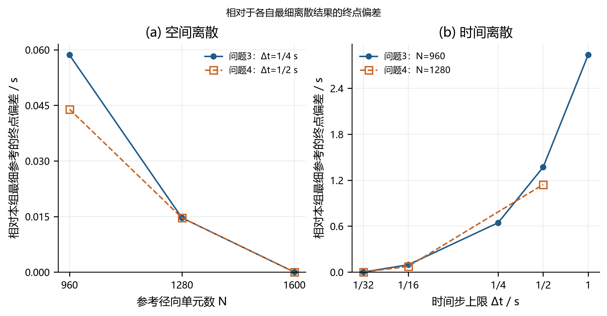
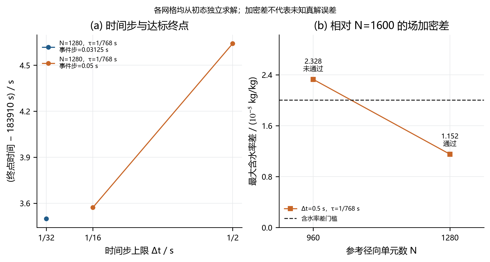

# 问题4数值验证附录

本文件只汇总已保存运行与独立比较记录，不启动数值模拟。

## 比较量与域外规则

以共同整60秒时刻分别核对21个固定物理位置、101个参考位置、真实表面和原网格全域最大值，定义

\[E_C=\max\{E_{C,\mathrm{physical}},E_{C,\mathrm{reference}},E_{C,\mathrm{surface}},E_M\},\qquad E_t=|t_{+,a}-t_{+,b}|.\]

固定物理位置只在两组相同的有效域内比较，先核对半径历史和逐点mask完全一致；域外NaN不能静默消除某一组内域误差。参考位置与真实表面单独核对，不由最外侧固定输出点代替。

主收缩模型的比较门槛为$E_C\le2\times10^{-5}$ kg/kg、$E_t\le0.1$ s；附录4固定半径控制计算用于评估整体时长效应，单独采用1 s终点差门槛。事件局部比较及其他检查使用各自记录的实际限值。加密差值与事件括区宽度不构成未知精确解的联合误差上界。

## 正式选档核验

原数组重算的必需比较全部通过。此处按选中配置的必需对照判断，历史粗档失败保留在后表。

| 检查 | 对照 | 物理C差 | 参考C差 | 表面C差 | 全域M差 | 终点差/s | 限值C/终点s | 结论 |
|---|---|---:|---:|---:|---:|---:|---|---|
| 时间步 | Q08→Q09 | 9.41217e-07 | 9.41217e-07 | 3.88454e-07 | 9.41217e-07 | 0.0732421875 | 2e-05 / 0.1 | 通过 |
| 空间网格 | Q05→Q14 | 7.52433e-06 | 1.15220e-05 | 5.04514e-06 | 4.74328e-07 | 0.0146484375 | 2e-05 / 0.1 | 通过 |
| 初期步长 | Q05→Q07 | 3.99386e-06 | 3.99386e-06 | 1.56801e-06 | 3.99386e-06 | 0.00732421875 | 2e-05 / 0.1 | 通过 |
| Picard容差 | Q05→Q06 | 4.08826e-13 | 2.02949e-13 | 1.84824e-13 | 1.41276e-14 | 0 | 2e-05 / 0.1 | 通过 |
| 事件容差 | Q10→Q11 | 0.00000e+00 | 0.00000e+00 | 0.00000e+00 | 0.00000e+00 | 0.00640869141 | 2e-05 / 0.02 | 通过 |
| 事件积分步长 | Q12→Q13 | 0.00000e+00 | 0.00000e+00 | 0.00000e+00 | 0.00000e+00 | 0 | 2e-05 / 0.02 | 通过 |
| 固定A4时间步 | Q18→Q19 | 3.17107e-06 | 3.17107e-06 | 1.33233e-06 | 3.17107e-06 | 0.732421875 | 2e-05 / 1 | 通过 |
| 固定A4空间网格 | Q18→Q20 | 5.06002e-06 | 1.15521e-05 | 5.06002e-06 | 4.96337e-07 | 0.029296875 | 2e-05 / 1 | 通过 |

## 已保存算例

| 编号 | N | Δt上限/s | 初期τ/s | 事件步/s | 夹逼容差/s | 半径模式 | 终点/s |
|---|---:|---:|---|---:|---:|---|---:|
| Q01 | 960 | 1.0 | 1/768 | 0.05 | 0.01 | 收缩 | 183915.820312500 |
| Q02 | 960 | 0.5 | 1/768 | 0.05 | 0.01 | 收缩 | 183914.611816406 |
| Q03 | 960 | 0.5 | 1/1536 | 0.05 | 0.01 | 收缩 | 183914.604492188 |
| Q04 | 960 | 0.0625 | 1/768 | 0.05 | 0.01 | 收缩 | 183913.542480469 |
| Q05 | 1280 | 0.5 | 1/768 | 0.05 | 0.01 | 收缩 | 183914.641113281 |
| Q06 | 1280 | 0.5 | 1/768 | 0.05 | 0.01 | 收缩 | 183914.641113281 |
| Q07 | 1280 | 0.5 | 1/1536 | 0.05 | 0.01 | 收缩 | 183914.633789062 |
| Q08 | 1280 | 0.0625 | 1/768 | 0.05 | 0.01 | 收缩 | 183913.571777344 |
| Q09 | 1280 | 0.03125 | 1/768 | 0.03125 | 0.01 | 收缩 | 183913.498535156 |
| Q10 | 1280 | 0.03125 | 1/768 | 0.03125 | 0.01 | 收缩 | 183913.498535156 |
| Q11 | 1280 | 0.03125 | 1/768 | 0.03125 | 0.001 | 收缩 | 183913.492126465 |
| Q12 | 1280 | 0.03125 | 1/768 | 0.03125 | 0.001 | 收缩 | 183913.492126465 |
| Q13 | 1280 | 0.03125 | 1/768 | 0.015625 | 0.001 | 收缩 | 183913.492126465 |
| Q14 | 1600 | 0.5 | 1/768 | 0.05 | 0.01 | 收缩 | 183914.655761719 |
| Q15 | 960 | 1.0 | 1/768 | 0.05 | 0.01 | 固定 | 467441.286621094 |
| Q16 | 960 | 0.5 | 1/768 | 0.05 | 0.01 | 固定 | 467439.851074219 |
| Q17 | 960 | 0.25 | 1/768 | 0.05 | 0.01 | 固定 | 467439.118652344 |
| Q18 | 1280 | 0.5 | 1/768 | 0.05 | 0.01 | 固定 | 467439.902343750 |
| Q19 | 1280 | 0.25 | 1/768 | 0.05 | 0.01 | 固定 | 467439.169921875 |
| Q20 | 1600 | 0.5 | 1/768 | 0.05 | 0.01 | 固定 | 467439.931640625 |

每个常规加密算例均从题设初态在自身原网格上独立求解；无问题3末态拼接或网格间初态投影。局部事件对照则从相同完整锚点重积分，不能用共享前缀的零差值冒充全程收敛。

## 全部实际加密记录

| 检查 | 对照 | 物理C差 | 参考C差 | 表面C差 | 全域M差 | 终点差/s | 限值C/终点s | 结论 |
|---|---|---:|---:|---:|---:|---:|---|---|
| 时间步 | Q05→Q08 | 7.22568e-06 | 7.22568e-06 | 3.00393e-06 | 7.22568e-06 | 1.06933594 | 2e-05 / 0.1 | 未通过 |
| 时间步 | Q08→Q09 | 9.41217e-07 | 9.41217e-07 | 3.88454e-07 | 9.41217e-07 | 0.0732421875 | 2e-05 / 0.1 | 通过 |
| 空间网格 | Q02→Q05 | 1.21985e-05 | 1.17607e-05 | 1.08998e-05 | 9.86880e-07 | 0.029296875 | 2e-05 / 0.1 | 通过 |
| 空间网格 | Q05→Q14 | 7.52433e-06 | 1.15220e-05 | 5.04514e-06 | 4.74328e-07 | 0.0146484375 | 2e-05 / 0.1 | 通过 |
| 空间跨两档 | Q02→Q14 | 1.35541e-05 | 2.32827e-05 | 1.59449e-05 | 1.46117e-06 | 0.0439453125 | 2e-05 / 0.1 | 未通过 |
| 初期步长 | Q05→Q07 | 3.99386e-06 | 3.99386e-06 | 1.56801e-06 | 3.99386e-06 | 0.00732421875 | 2e-05 / 0.1 | 通过 |
| Picard容差 | Q05→Q06 | 4.08826e-13 | 2.02949e-13 | 1.84824e-13 | 1.41276e-14 | 0 | 2e-05 / 0.1 | 通过 |
| 事件容差 | Q10→Q11 | 0.00000e+00 | 0.00000e+00 | 0.00000e+00 | 0.00000e+00 | 0.00640869141 | 2e-05 / 0.02 | 通过 |
| 事件积分步长 | Q12→Q13 | 0.00000e+00 | 0.00000e+00 | 0.00000e+00 | 0.00000e+00 | 0 | 2e-05 / 0.02 | 通过 |
| 空间网格 | Q04→Q08 | 1.21985e-05 | 1.17607e-05 | 1.08998e-05 | 9.86900e-07 | 0.029296875 | 2e-05 / 0.1 | 通过 |
| 初期步长 | Q02→Q03 | 3.99384e-06 | 3.99384e-06 | 1.56801e-06 | 3.99384e-06 | 0.00732421875 | 2e-05 / 0.1 | 通过 |
| 时间步 | Q01→Q02 | 7.66889e-06 | 7.66889e-06 | 2.15123e-06 | 7.66889e-06 | 1.20849609 | 2e-05 / 0.1 | 未通过 |
| 时间步 | Q02→Q04 | 7.22568e-06 | 7.22568e-06 | 3.00394e-06 | 7.22568e-06 | 1.06933594 | 2e-05 / 0.1 | 未通过 |
| 固定A4空间网格 | Q18→Q20 | 5.06002e-06 | 1.15521e-05 | 5.06002e-06 | 4.96337e-07 | 0.029296875 | 2e-05 / 1 | 通过 |
| 固定A4空间网格 | Q16→Q20 | 1.59919e-05 | 2.33508e-05 | 1.59919e-05 | 1.52889e-06 | 0.0805664062 | 2e-05 / 1 | 未通过 |
| 固定A4时间步 | Q18→Q19 | 3.17107e-06 | 3.17107e-06 | 1.33233e-06 | 3.17107e-06 | 0.732421875 | 2e-05 / 1 | 通过 |
| 固定A4时间步 | Q15→Q16 | 5.75942e-06 | 5.75942e-06 | 1.69516e-06 | 5.75942e-06 | 1.43554688 | 2e-05 / 1 | 未通过 |
| 固定A4时间步 | Q16→Q17 | 3.17106e-06 | 3.17106e-06 | 1.33233e-06 | 3.17106e-06 | 0.732421875 | 2e-05 / 1 | 通过 |

表中含水率差的单位均为kg/kg；各自终点的参考剖面差发生在各自的终点时刻，单独保存，不能直接代替同一物理时刻的场误差。

主收缩模型保留了N=960→1600的网格筛选失败：最大含水率加密差2.328269123e-05 kg/kg出现在t=120 s、ξ=0.97，超过2e-05 kg/kg门槛。不能仅凭终点时间差接受该网格，正式选档以此前列出的必需比较为依据。

附录4固定半径对照保留了N=960→1600的网格筛选失败：最大含水率加密差2.335083905e-05 kg/kg出现在t=120 s、ξ=0.97，超过2e-05 kg/kg门槛。不能仅凭终点时间差接受该网格，正式选档以此前列出的必需比较为依据。

## 问题3与问题4的终点加密总图

各问题在各自参数匹配的空间、时间序列内选择最细参考；参考档的自比较零值保留在线性纵轴上。问题3空间序列使用各网格自身的问题2末态，时间序列共用正式问题2末态；问题4各常规算例均从初态独立计算。全部点值、固定配置与来源记录见[q4_combined_convergence.json](q4_combined_convergence.json)。

## 时间步与网格加密结果

左图仅绘实际保存的时间步配置与终点，各点之间未补造缺失档位；事件积分步长按实际值分组。右图以更细网格的数值结果作共同参考，展示固定物理点、参考位置、真实表面及全域最大值四类含水率差的最大值。图中的通过标记仅指含水率差门槛，空间终点差仍见数值表。

## 正式文件与收支核对

以下数值直接读取正式检查记录。位置数按每一场量的全部保存时刻计数，Excel的规则分钟输出另表统计。

| 模型 | 检查结论 | 最大水量收支残差 / (kg/kg) | 域内物理位置数 | 域外物理位置数 | 参考位置数 |
|---|---|---:|---:|---:|---:|
| 附录4收缩 | 通过 | 9.992007222e-13 | 195792 | 113975 | 309767 |
| 附录4固定 | 通过 | 1.585842568e-12 | 786992 | 0 | 786992 |

| 正式输出核对量 | 实际数量或结论 |
|---|---:|
| Excel整60秒数据行 | 3065 |
| 固定位置域内含水率值 | 41206 |
| 固定位置域外空白 | 23159 |
| 独立真实表面含水率值 | 3065 |
| 表6数据行 | 9 |
| 精确终点文件核对 | 通过 |
| 导出整体结论 | 通过 |

基础离散核对通过：核对了145个半径输入节点及92个精确平台区间；插值越过相邻观测范围的最大值为0.000e+00 m。

| 固定缩放下的独立稠密参考 | 温度最大差 / K | 含水率最大差 / (kg/kg) | 累计失水差 / (kg/kg) |
|---|---:|---:|---:|
| s=1 | 0.000000e+00 | 0.000000e+00 | 1.355253e-20 |
| s=0.6 | 0.000000e+00 | 0.000000e+00 | 6.776264e-20 |

相同时间步边界下保存—重载的最大差分别为：温度0.000000e+00 K，含水率0.000000e+00 kg/kg，累计失水2.602085e-18 kg/kg。封闭均匀场、移动表面重构与内部最大值位置的检查结论，以及完整来源散列均保留在原JSON中。

完整检查记录：[q4_checks.json](q4_checks.json)。

## 附录独立运行复现

完整附录运行与正式结果的复现核对通过。附录从题设均匀初态独立推进第四问全程，未读取问题3末态作为初值；核对对象是所采用同一算法的独立运行一致性，并非新的物理模型验证或内部实测验证。

两次运行的终点均为183913.49853516 s。检查程序对终点时间、事件括区、全部保存时刻以及21个固定物理位置的域内外掩码要求完全相同；原生网格的完整终态与其他未舍入场量逐项比较，限值为1×10⁻¹²。

\[E_{\mathrm{reproduce}}(u)=\max_i|u_i^{\mathrm{appendix}}-u_i^{\mathrm{formal}}|.\]

| 未舍入核对量 | 最大绝对差 | 单位 |
|---|---:|---|
| 完整原生网格终态温度 | 0.000000000e+00 | K |
| 完整原生网格终态含水率 | 0.000000000e+00 | kg/kg |
| 全部保存时刻的半径 | 0.000000000e+00 | m |
| 真实表面温度 | 0.000000000e+00 | K |
| 真实表面含水率 | 0.000000000e+00 | kg/kg |
| 原生网格全域最大含水率历史 | 0.000000000e+00 | kg/kg |
| 实际最大含水率位置历史 | 0.000000000e+00 | m |
| 水量收支残差历史 | 5.773159728e-15 | kg/kg |
| 累计失水历史 | 0.000000000e+00 | kg/kg |
| 固定21个物理位置的域内温度 | 5.684341886e-14 | K |
| 固定21个物理位置的域内含水率 | 8.881784197e-16 | kg/kg |

两份result4.xlsx的3065行数据逐格相同：共64365个固定位置单元（包括材料域外空白）及3065个独立表面数值。域外空白参与比较，未将其改写为零或表面值。

来源链由附录求解文件、独立数值输出、正式数值输出及正式Excel的SHA-256记录固定：

| 来源文件 | SHA-256 |
|---|---|
| [paper_appendix_minimal/minimal_solver.py](../paper_appendix_minimal/minimal_solver.py) | 5d71f167f34a16836be988d7bea5ecb7a449b44694c54888c075a028454cf2f4 |
| [paper_appendix_minimal/minimal_q4.py](../paper_appendix_minimal/minimal_q4.py) | 9540aa278779fb4a1f1bd07536372f47f17be6a61e30a89a49c0db461471477e |
| [paper_appendix_minimal/reproduced/q4/q4_independent.npz](../paper_appendix_minimal/reproduced/q4/q4_independent.npz) | d1ffee71b3a4858fb6f3ac94643f961580cd938ff3169f405f2ca51e9673507d |
| [paper_appendix_minimal/reproduced/q4/result4.xlsx](../paper_appendix_minimal/reproduced/q4/result4.xlsx) | e1351a3901226b38d6126bcf670b92b95e0080c90070f74314c74ab796280cb1 |
| [data/attachment1.xlsx](../data/attachment1.xlsx) | 7ef32870abeef420b89560b2530ff60dfe4255917805151d89988d0311af9dd7 |
| [data/attachment2.xlsx](../data/attachment2.xlsx) | 5563acbfa4b4afb10cc6c03e2207e5369bf39da27576672aff14cc5c32e704af |
| [q4/solution.npz](../q4/solution.npz) | 33f1192de2ea75440667f2c616b7134c388f0829c62673fb94f59b0ae8dd6ce2 |
| [submission_results/result4.xlsx](../submission_results/result4.xlsx) | 320312faa01c3cc5b3aeca7974f2a6dcfb56b15dfd47ff3e492e932fa4da6ec7 |

## 证据索引

- [q4_convergence_time.json](q4_convergence_time.json)
- [q4_convergence_space.json](q4_convergence_space.json)
- [q4_convergence_startup.json](q4_convergence_startup.json)
- [q4_convergence_picard.json](q4_convergence_picard.json)
- [q4_convergence_event.json](q4_convergence_event.json)
- [q4_convergence_event_step.json](q4_convergence_event_step.json)
- [q4_convergence_space_fine.json](q4_convergence_space_fine.json)
- [q4_convergence_startup_N960.json](q4_convergence_startup_N960.json)
- [q4_convergence_time_N960.json](q4_convergence_time_N960.json)
- [q4_space_screen.json](q4_space_screen.json)
- [q4_fixed_space.json](q4_fixed_space.json)
- [q4_fixed_space_N960.json](q4_fixed_space_N960.json)
- [q4_fixed_time_final.json](q4_fixed_time_final.json)
- [q4_fixed_time_initial.json](q4_fixed_time_initial.json)
- [q4_fixed_time_N960.json](q4_fixed_time_N960.json)
- [q4_selected_config.json](q4_selected_config.json)
- [q4_acceptance.json](q4_acceptance.json)
- [q4_checks.json](q4_checks.json)
- [q4_reproduction.json](q4_reproduction.json)
- Q01：`q4_N960_dt1_startup768_shrinking_evdt0.05_tol0.01`；[q4_N960_dt1_startup768_shrinking_evdt0.05_tol0.01.npz](../q4/runs/q4_N960_dt1_startup768_shrinking_evdt0.05_tol0.01.npz)。
- Q02：`q4_N960_dt0.5_startup768_shrinking_evdt0.05_tol0.01`；[q4_N960_dt0.5_startup768_shrinking_evdt0.05_tol0.01.npz](../q4/runs/q4_N960_dt0.5_startup768_shrinking_evdt0.05_tol0.01.npz)。
- Q03：`q4_N960_dt0.5_startup1536_shrinking_evdt0.05_tol0.01`；[q4_N960_dt0.5_startup1536_shrinking_evdt0.05_tol0.01.npz](../q4/runs/q4_N960_dt0.5_startup1536_shrinking_evdt0.05_tol0.01.npz)。
- Q04：`q4_N960_dt0.0625_startup768_shrinking_evdt0.05_tol0.01`；[q4_N960_dt0.0625_startup768_shrinking_evdt0.05_tol0.01.npz](../q4/runs/q4_N960_dt0.0625_startup768_shrinking_evdt0.05_tol0.01.npz)。
- Q05：`q4_N1280_dt0.5_startup768_shrinking_evdt0.05_tol0.01`；[q4_N1280_dt0.5_startup768_shrinking_evdt0.05_tol0.01.npz](../q4/runs/q4_N1280_dt0.5_startup768_shrinking_evdt0.05_tol0.01.npz)。
- Q06：`q4_N1280_dt0.5_startup768_shrinking_evdt0.05_tol0.01_tight`；[q4_N1280_dt0.5_startup768_shrinking_evdt0.05_tol0.01_tight.npz](../q4/runs/q4_N1280_dt0.5_startup768_shrinking_evdt0.05_tol0.01_tight.npz)。
- Q07：`q4_N1280_dt0.5_startup1536_shrinking_evdt0.05_tol0.01`；[q4_N1280_dt0.5_startup1536_shrinking_evdt0.05_tol0.01.npz](../q4/runs/q4_N1280_dt0.5_startup1536_shrinking_evdt0.05_tol0.01.npz)。
- Q08：`q4_N1280_dt0.0625_startup768_shrinking_evdt0.05_tol0.01`；[q4_N1280_dt0.0625_startup768_shrinking_evdt0.05_tol0.01.npz](../q4/runs/q4_N1280_dt0.0625_startup768_shrinking_evdt0.05_tol0.01.npz)。
- Q09：`q4_N1280_dt0.03125_startup768_shrinking_evdt0.05_tol0.01`；[q4_N1280_dt0.03125_startup768_shrinking_evdt0.05_tol0.01.npz](../q4/runs/q4_N1280_dt0.03125_startup768_shrinking_evdt0.05_tol0.01.npz)。
- Q10：`q4_local_event_N1280_dt0.03125_startup768_shrinking_evdt0.03125_tol0.01`；[q4_local_event_N1280_dt0.03125_startup768_shrinking_evdt0.03125_tol0.01.npz](../q4/runs/q4_local_event_N1280_dt0.03125_startup768_shrinking_evdt0.03125_tol0.01.npz)。
- Q11：`q4_local_event_N1280_dt0.03125_startup768_shrinking_evdt0.03125_tol0.001`；[q4_local_event_N1280_dt0.03125_startup768_shrinking_evdt0.03125_tol0.001.npz](../q4/runs/q4_local_event_N1280_dt0.03125_startup768_shrinking_evdt0.03125_tol0.001.npz)。
- Q12：`q4_local_event_step_N1280_dt0.03125_startup768_shrinking_evdt0.03125_tol0.001`；[q4_local_event_step_N1280_dt0.03125_startup768_shrinking_evdt0.03125_tol0.001.npz](../q4/runs/q4_local_event_step_N1280_dt0.03125_startup768_shrinking_evdt0.03125_tol0.001.npz)。
- Q13：`q4_local_event_step_N1280_dt0.03125_startup768_shrinking_evdt0.015625_tol0.001`；[q4_local_event_step_N1280_dt0.03125_startup768_shrinking_evdt0.015625_tol0.001.npz](../q4/runs/q4_local_event_step_N1280_dt0.03125_startup768_shrinking_evdt0.015625_tol0.001.npz)。
- Q14：`q4_N1600_dt0.5_startup768_shrinking_evdt0.05_tol0.01`；[q4_N1600_dt0.5_startup768_shrinking_evdt0.05_tol0.01.npz](../q4/runs/q4_N1600_dt0.5_startup768_shrinking_evdt0.05_tol0.01.npz)。
- Q15：`fixed_N960_dt1_startup1over768_evdt0.05_tol0.01`；[fixed_N960_dt1_startup1over768_evdt0.05_tol0.01.npz](../q4/cases/fixed_N960_dt1_startup1over768_evdt0.05_tol0.01.npz)。
- Q16：`fixed_N960_dt0.5_startup1over768_evdt0.05_tol0.01`；[fixed_N960_dt0.5_startup1over768_evdt0.05_tol0.01.npz](../q4/cases/fixed_N960_dt0.5_startup1over768_evdt0.05_tol0.01.npz)。
- Q17：`fixed_N960_dt0.25_startup1over768_evdt0.05_tol0.01`；[fixed_N960_dt0.25_startup1over768_evdt0.05_tol0.01.npz](../q4/cases/fixed_N960_dt0.25_startup1over768_evdt0.05_tol0.01.npz)。
- Q18：`fixed_N1280_dt0.5_startup1over768_evdt0.05_tol0.01`；[fixed_N1280_dt0.5_startup1over768_evdt0.05_tol0.01.npz](../q4/cases/fixed_N1280_dt0.5_startup1over768_evdt0.05_tol0.01.npz)。
- Q19：`fixed_N1280_dt0.25_startup1over768_evdt0.05_tol0.01`；[fixed_N1280_dt0.25_startup1over768_evdt0.05_tol0.01.npz](../q4/cases/fixed_N1280_dt0.25_startup1over768_evdt0.05_tol0.01.npz)。
- Q20：`fixed_N1600_dt0.5_startup1over768_evdt0.05_tol0.01`；[fixed_N1600_dt0.5_startup1over768_evdt0.05_tol0.01.npz](../q4/cases/fixed_N1600_dt0.5_startup1over768_evdt0.05_tol0.01.npz)。
