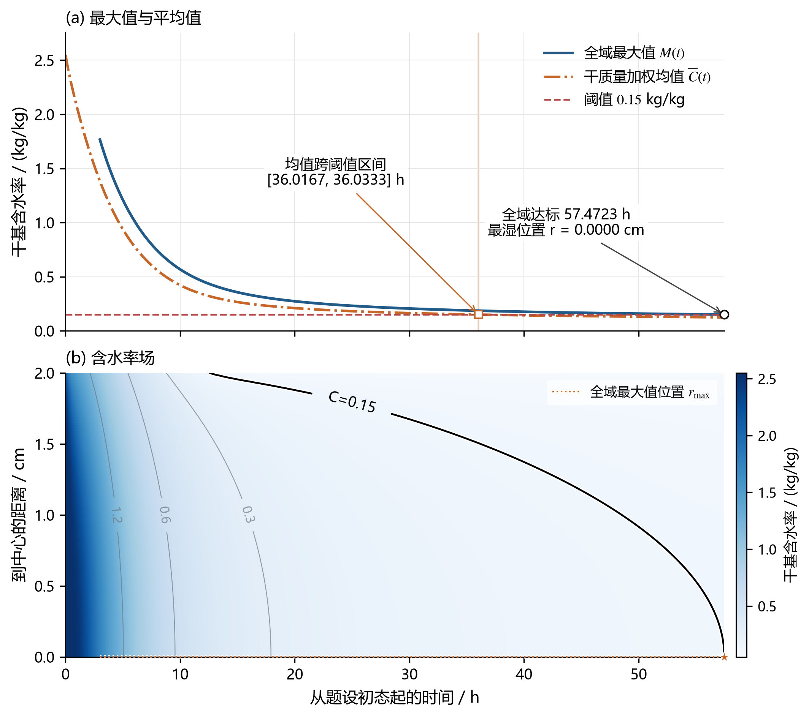

# 第三问解答：全域干燥达标时间

本次从第二问3 h的完整网格状态重新续算，得到从初始加热起算的总时间

\[
\boxed{t_3=57.4723\ \mathrm h.}
\]

最后达标位置为中心。终点中心、表面干基含水率分别显示为0.1500、0.0527 kg/kg；中心未舍入值已经严格低于0.15，显示为0.1500不表示判定用了等号。

**模型与续算。** 保持半径 \(R_0=0.02\ \mathrm m\)，沿用第二问附录3物性：

\[
\begin{aligned}
\rho&=650+128C,&c_p&=1450+2736\frac{C}{1+C},\\
k&=0.21+0.38\frac{C}{1+C},&D&=2.4\times10^{-3}\exp\!\left(-\frac{0.45}{C}-\frac{3850}{T}\right).
\end{aligned}
\]

温度 \(T\) 用K，含水率 \(C\) 用干基kg/kg。继续求解

\[
\rho c_p T_t=\frac1r\partial_r(rkT_r),\qquad
C_t=\frac1r\partial_r(rDC_r).
\]

中心满足 \(T_r=C_r=0\)；表面满足

\[
-kT_r=h(T_s-T_\infty),\qquad
-DC_r=h_m(C_s-C_\infty^{\mathrm{eff}}),
\]

其中 \(h=25\ \mathrm{W/(m^2\!\cdot K)}\)、\(h_m=8\times10^{-7}\ \mathrm{m/s}\)。读取第二问在10800 s的全部温度、含水率和原网格，时间保持连续；3—4 h使用附件1的分段线性插值，4 h后按既定假设取50℃、0.0500 kg/kg。温度仍随含水率耦合计算。

**离散与终点。** 使用960个表面加密圆柱壳、全隐式时间推进及Picard迭代，续算步长上限为 \(1/32\ \mathrm s\)。令

\[
M_h(t)=\max\{C_{\mathrm{center}}^{\mathrm{rec}},C_1,\ldots,C_N,C_{\mathrm{surface}}^{\mathrm{bc}}\},\qquad g(t)=M_h(t)-0.15.
\]

检查全部网格单元，加入中心对称重构值及符合表面边界的重构值。发现阈值跨越后，从同一未达标完整状态对候选时刻重新积分，直至 \(g(t_-)\ge0\)、\(g(t_+)<0\)、\(t_+-t_-\le0.01\ \mathrm s\)，报告 \(t_+\)。这里0.01 s约束的是数值终点区间宽度，不是实际干燥时间的总误差。

**结果及解释。**

| 时间 / h | r=0 cm | r=0.5 cm | r=1 cm | r=1.5 cm | r=2 cm |
|---|---:|---:|---:|---:|---:|
| 6 | 1.0170 | 0.9881 | 0.9015 | 0.7550 | 0.5328 |
| 12 | 0.4561 | 0.4432 | 0.4031 | 0.3297 | 0.1642 |
| 18 | 0.2988 | 0.2915 | 0.2687 | 0.2253 | 0.0845 |
| 24 | 0.2378 | 0.2327 | 0.2167 | 0.1855 | 0.0665 |
| 30 | 0.2058 | 0.2018 | 0.1892 | 0.1641 | 0.0598 |
| 36 | 0.1859 | 0.1825 | 0.1718 | 0.1504 | 0.0566 |
| 42 | 0.1721 | 0.1691 | 0.1597 | 0.1407 | 0.0549 |
| 48 | 0.1618 | 0.1592 | 0.1507 | 0.1334 | 0.0537 |
| 54 | 0.1539 | 0.1514 | 0.1436 | 0.1277 | 0.0530 |
| 57.4723（终点） | 0.1500 | 0.1477 | 0.1402 | 0.1249 | 0.0527 |

水量按不变的干物质质量权重 \(w_i=V_i/\sum_jV_j\) 核算：

\[
\overline C(t)=\sum_iw_iC_i(t),\qquad
B_3(t)=\overline C(t)+L_2+L_3(t)-2.55.
\]

终点平均含水率为0.124308 kg/kg，单位初始干物质质量累计失水为2.425692 kg/kg；全程最大收支残差为2.540e-12 kg/kg，续算失水已经接入第二问前3 h累计量。

按一分钟保存结果，平均含水率越过0.15的时间位于36.0167—36.0333 h；若用平均值停机，将比全域达标提前21.4390—21.4557 h，约21.45 h。因此平均含水率不能替代题目要求的“各处均达标”。该范围来自相邻保存值，没有将插值交点冒充重新积分的精确终点。

图中最大值曲线从3 h开始，0—3 h未保存完整网格的最大值历史，因此留空；均值及含水率场来自已保存的全过程结果。图上的连线和等值线仅用于显示，终点由未舍入网格状态判定。

**核验与输出。** 本轮重算与原正式解的比较见[重算与验证说明](validation/redone_20260912/验证说明.md)。原始加密数组重新核对后，第三问 \(960\to1280\) 网格比较的终点差为0.0439 s；续算步长 \(1/16\to1/32\ \mathrm s\) 的终点差为0.0952 s。网格比较使用各自网格的第二问末态、相同0.25 s续算步长；不能把这些差值称为未知真解的误差界。

[result3.xlsx](submission_results/result3.xlsx)按60 s、0.1 cm输出。非整分钟的准确终点另存[q3/endpoint.json](q3/endpoint.json)和上表最后一行，不加入整分钟数据末行。

环境水分指标按药材侧等效驱动解释；经验密度用于有效热容量。主模型采用一维径向近似，不显式加入潜热，其影响尚未定量评估。以上结论是这些假设下的数值预测，不是内部温湿场实验验证。
